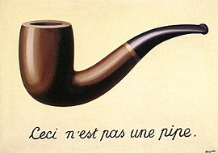

I _love_ references. I love everything about them. Making them, getting them, even not getting them and then learning about them. I also realise they're not for everyone. But before I can get into why I love them and what's so special about them, I want to present a primer on how they work. In order to understand references, we need to understand some basic constructs of language.

#### 1: The Treachery of Words

In 1929, a Belgian surrealist painter named René Magritte painted this image of a pipe, and insisted that it was not a pipe. He was right of course. You can't stuff the pipe. You can't smoke it. It is a representation that is enough to remind you of the thing itself. For the programmers reading this - there is the object, and then there is a pointer to the object. Creating an image of an object is a pass by reference. It is not the thing itself. Similarly, I posit what I assume will be an uncontroversial opinion that words are also not the elements themselves. Rather they are pointers that tell our brains to think about things we've seen. Or, even not seen. You've never seen a pink elephant, but your brain would have no trouble conjuring up an image of one1.

So words are just clever ways of throwing other things we know together, that build on other things we know to exist. It is, in my opinion, the single most impressive things we do as humans. By creating words for objective things like pipe and man and squirrel, we have graduated to more complex ideas such as country and even ways of organising ourselves into completely human-generated constructs like President and democracy. All so that I can say, "It would be a bad idea to let a person with the attention span of a squirrel become the President of a country" and you would understand what I was saying2. But I digress.

#### 2: Overload! Overload!

It is hard, though to keep everything straight in our heads because of this complexity. Objective reality is one thing, but on top of that objective reference to a very real thing, There are layers of meaning - contexts and implications. Whether that word means something different to a different person. Whether it has a special context to your friends, your family, your country, your race, religion, gender. Constructs upon constructs that you have to process for every word you say. It's a wonder we manage to communicate at all. If you look at Twitter, it makes a lot more sense now. There's a reason computer programmers made sure a pointer pointed to one thing, and not several different things depending on who is saying it and who is listening and what the context is. Words are hard. Take the word man. In and of itself, the word man can just mean any male human being. But we've complicated it just a bit. Over time, it's become associated with connotations of bravery and chivalry and nobility, and to about 50% of the human population, oppression and a befuddling inability to take out the trash.

Words are loaded with meaning. In fact they're overloaded. Communication is a very high bandwidth activity. and references are a way to hack the programming.

#### 3. Cool. Can you tell me what a reference is now, please

Technically, anything you say could be a reference. Our communication is so laden with meaning that it wouldn't be surprising if someone was able to pick some deeper meaning out of it. However, when I speak of references I'm really talking about an intentional layer loaded into the words being written/spoken that in some way remind someone who gets it about a person, a book, movie, TV show, or possibly just a past event that was memorable in some way. A reference is, in a technical sense, a double entendre - except used to suggest something other than the idea of sex in general.

A reference can be executed in myriad ways, but here are some of the most common:

- A memorable catchphrase being said in a new context. E.g. saying, "Hasta la Vista, baby" before stamping on a cockroach in your kitchen. I'm not sure who you would have said it for. I presume the cockroach did not care for the reference. It most certainly did not care for being trampled on.

- Doing a particular voice/accent or physical movement as an impersonation of a particular character. This is generally done in conjunction with the catchphrase e.g. doing Arnold's voice while killing said cockroach, but it may be done as its own thing separate thing entirely

- Implication that a general thing is a more specific thing. This can be done by calling something a specific name based on appearance. Nicknames are a good example of this kind of reference. E.g. proudly walking back into your bedroom and saying, "Gregor Samsa's been taken care of"

Okay, that was a lot to go over in a post, but I feel it's such a cool use of context overload in language that I just had to go over it. In Part 2, I'll go over how it's useful and my favourite ways of using it. You can find part 2 [here](paraghbhtngr.github.io/blog/in-praise-of-references-part-2).

<small>
  1: This is true for most, but not all people. There is a particular condition
  called aphantasia, which renders its sufferers unable to visualise mental
  images. If you found yourself disagreeing about that particular point, you may
  wish to look into that.  
  2: Unless you were a Republican, of course.
</small>
