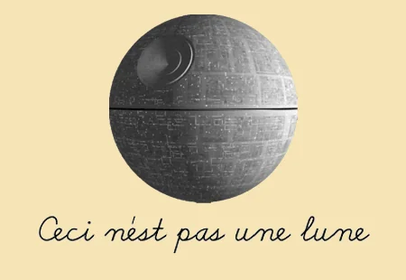

In the last post, I ended off with a working definition of what a reference is. In this post I want to go over some of my favourite applications of references. If you haven't read part 1, you can find it [here](paraghbhtngr.github.io/blog/in-praise-of-references-part-1)

#### 1: Sharing the moment

Every good story (book, film, TV show) has iconic moments. Even some of the bad ones do. If you're a fan of that piece of work, you probably want to share your favourite moments from that fandom with those who are in it. The easiest and quickest way of doing that is by making a reference to the fandom - something that someone who's seen/read the thing would get.

Side note here about the obscurity of the reference made: A very obvious reference may be understood by most people, even those who aren't familiar with the subject matter. The quote, "Luke, I am your father1" may be familiar to not just Star Wars fans, but most people at this point, even if they haven't seen the movies. You might even have luck with people knowing the famous "That's no moon" line when talking about the Death Star. However, it's likely that fewer people would get a more obscure reference from the franchise, like "I love democracy2".

#### 2: Finding your people hiding in plain sight

Hey, you know James from accounting? Yeah, the guy who wears different shades of the same blue shirt to work everyday? Did you know that he's really into Dungeons & Dragons? And I wouldn't have known unless I had made the offhand remark that I'm going to take 1 point of exhaustion from the work I have today.

Not everyone wears their fandoms loud and proud all the time. Most people just do it at Comic-Con. But a sneakily hidden reference can be a useful way to find your people. Because fandoms and interests create communities of people who obsess over them, and it is a nice feeling to know you're not the only one. References can be a shorthand, a litmus test to draw out these timid creatures who don't display their fandoms out in the open. I've made very obscure references in the past hoping to find my people, and sometimes I do find them. I've found people who get the most obscure British panel show references and it is such an exhilarating feeling once I have, but that will usually create a rabbit hole that both of us will go down and potentially exclude everyone else from for a while.

References are like secret passwords to get into the speakeasy of the fandom, and the smaller the community that loves something, the more exciting it can be to find someone else who enjoys it. Quite a lot of people will get a Harry Potter or a Game of Thrones reference, so finding someone who likes these things can be exciting, but not as exciting as say, finding someone who watched Firefly and is still low-key mad about it being cancelled. For There is a dark side to this, and I'd be remiss not to discuss this.

#### 3. Gatekeeping

Are you a _true_ fan of Marvel? No like a _**true**_ fan. Like not just an MCU fan but have you read the comics, and you care about the Earth-616 universe first and foremost and not just Earth-199999... stop. Look, I get you and I love nerding out about these things. And they can be useful to find people who care as deeply about something as you and that's great. But for everyone a reference includes, there are those who may feel excluded by not being in on the joke. Most people have likely been part of a group when the entire group gets something that one person doesn't. And that's not a fun feeling, if the group uses it as a way of excluding you. I'm far from one to dictate how you should choose to communicate, but my personal approach to it is to either make a reference most people will get, or a reference most people will not get - for that one person who does they will feel extra special for having got it, while making most people not feel left out. If I simply must make a reference that I want everyone to get and people don't, I will adopt the rule of the lucky 10,000.

<figcaption align="center">
  <small>XKCD: Ten Thousand - https://xkcd.com/1053/</small>
</figcaption>

#### 4. Jargon

Technically a reference, and a technical reference - the use of jargon that would be known only by someone who knows the field can be used to project knowledge of the field to those who know. I use this when speaking to programmers and designers and 3D modellers all the time. Given my experience working with these technologies I am familiar with the technical stuff, and sometimes talking tech with someone can make them a lot more at ease when discussing stuff with you. When I have to 'dumb down' stuff to talk to people who don't understand me, sometimes it can be a frustrating experience. If only I could explain it to them in the technical terms it would be so much easier! I try to do this with everyone, not just the aforementioned fields though. I find communication on a technical level is so much easier if I understand just a bit about the field I'm working in.

Beware the person that hides behind big words, however. You will no doubt run into someone who obfuscates their ineptitude in bombastic jargon (like so). I try not to do it anymore but I've definitely been guilty of it. It helps with the impostor syndrome. But sometimes it takes a crook to catch one, and my knowledge of how to BS definitely helps me detect when I'm being fed some. If a person can't or won't explain something in simple terms, they're BS-ing you. As much as I like to make people feel comfortable expressing themselves, sometimes if I'm not sure if the person knows what they're talking about it's worth going back to the simple stuff.

#### 5. Bringing people together - the callback

Okay, you know how to reference stuff that already exists. This one is referencing a moment you just created. Stand-up comedians call this trick the callback. They tell you about something at the beginning of the routine. There's a punchline. It's good so you remember it, and then the show goes on. Then in the end, there's another joke with the same punchline, but in a different context. And you get it because you were there for the first one. You're in on the joke - you and everyone else in that room were part of something that no one else will get, and that makes you feel special. It's a simple trick, but 60% of the time, it works every time3. Next time you're watching a stand-up special keep an eye out for it. If you're interested in a breakdown of how the callback works in stand-up, you may also enjoy [this video](https://www.youtube.com/watch?v=_IEbXL8QEE8).

#### 6. I Can haz memes

Saving the best for last, memes are probably the most ubiquitous and pervasive use of references. It's something that most people would be familiar with if you've been on the internet for more than 30 minutes. If you're reading this on the internet, you already know what memes are. But what is the point of memes? Well, they are a variant of finding your people but extended to the internet that identifies you as belonging to a particular internet group. There are memes that have transcended subreddits and Facebook groups and become a general template for the internet to follow, but this ubiquity comes with the price of losing out in favour of the more niche in-joke. Think about LOLcats, Advice Animal memes (Philosoraptor, Bad Luck Brian, Hide the Pain Harold) and how they grew and faded from cultural relevance. Meme culture is the in-joke format of the internet, and is the epitome of reference usage for community building there is. If you weren't convinced about the power of reference yet, I'm sure this will have proved how fundamental and powerful a communication tool they can be. For a more thorough dive into memes, internet culture and communication, I highly recommend Gretchen McCullough's wonderful book "Because Internet: Understanding the New Rules of Language".

I'm sure there are a bunch of other examples, sub-genres and uses of references in all kinds of contexts, but this was never intended to be an exhaustive list. Indeed, I don't think there can be one, but this is a brief tour of my favourite ways we use this technique to communicate with each other.

I shall leave you with my favourite meme-based reference.

 

<small>
1: Before people come at me, I know this is a misquote. The actual quote is, "No, I am your father". But it's likely that only pedants and the most hardcore of Star Wars nerds would know that. If that's you, hello there! 
2: Did I include the prequels - yousa betcha your ass meesa did 
3: [https://www.youtube.com/watch?v=pjvQFtlNQ-M](https://www.youtube.com/watch?v=pjvQFtlNQ-M)

</small>
