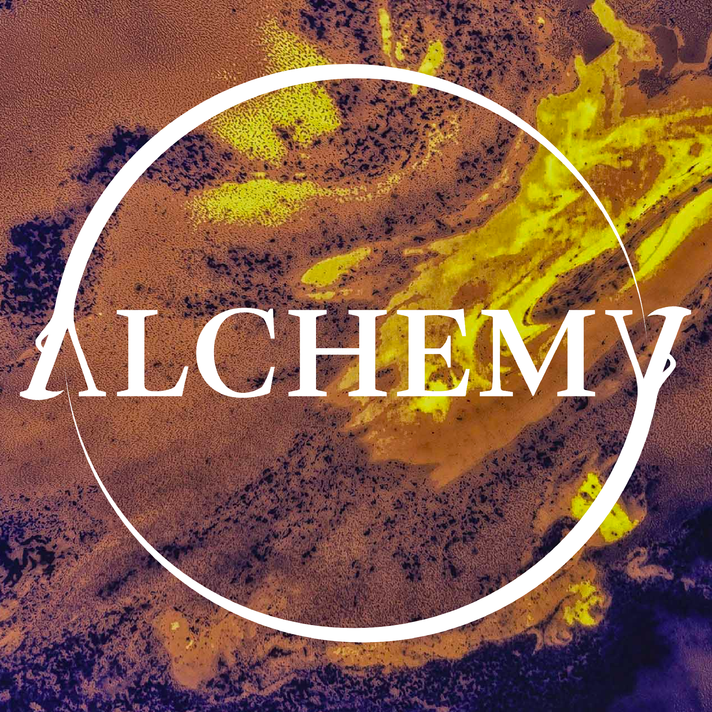

 

Alchemy was a Literary Collective that would share poems, short stories, art and other creative projects by Yale-NUS students. Given that it was a literary collective, I really wanted the logo to be a logotype, instead of it being iconographic or graphic-heavy, I wanted to let the text do most of the heavy lifting.

The ouroboros was a visual element I introduced due to its long history with alchemic practices. It is an image linked with the Philosopher's Stone (not the Harry Potter version) - a symbol of the eternal unity of all things, the cycle of birth and death from which the alchemist sought release and liberation. Therefore it was only fitting that it be the visual flair in the logotype.

Given the sort of symmetrical natures of the letters A and Y, I modified them to form the gaping mouths of a double ouroboros, using a serif font with long serifs to make the fangs of the ouroboros visually coherent with the font.
