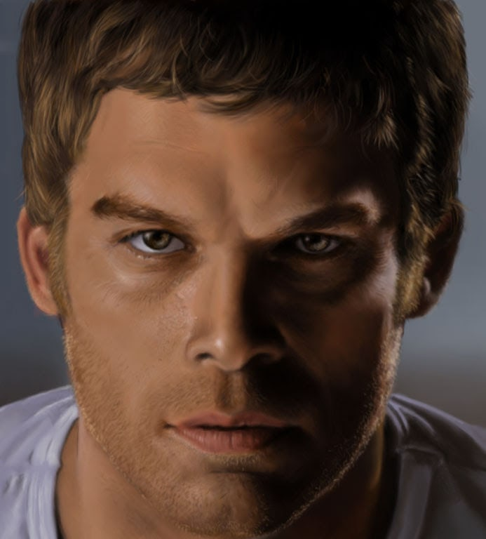

 

I think there's something about me that's attracted to the villain, anti-hero and the man with a compromised sense of morality. But that's enough psychotherapy for today.

I drew this portrait after finishing my A Levels, and over a 6-month gap between school and university. Suffering from an existential crisis, not much to do and an interest in photorealism, I decided to spend 60 hours finishing up this portrait of Michael C Hall, having finished binge watching Dexter.

I've never attempted anything as time-consuming since, although I would like to at some point.
