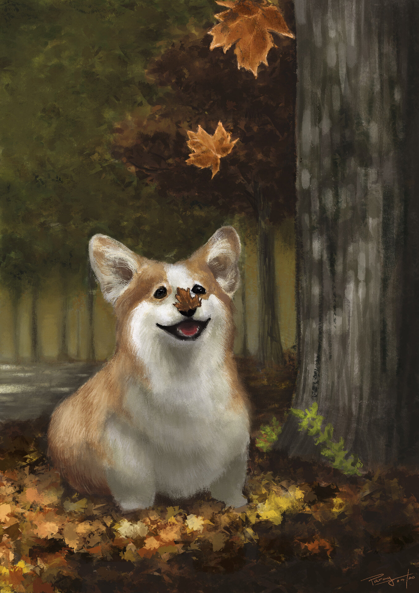

 A response to a question I don't know if anyone's ever asked - what would
it look like if the Renaissance Masters spent their time drawing corgis instead
of women. Obviously the patronage would have to come from very different sources
\- possibly very well-to-do Welsh individuals. Maybe the Queen of England. Who
knows? Were there even corgis around during that time? I don't know, but for
whatever reason, it was a missed opportunity. I have remedied that here.
