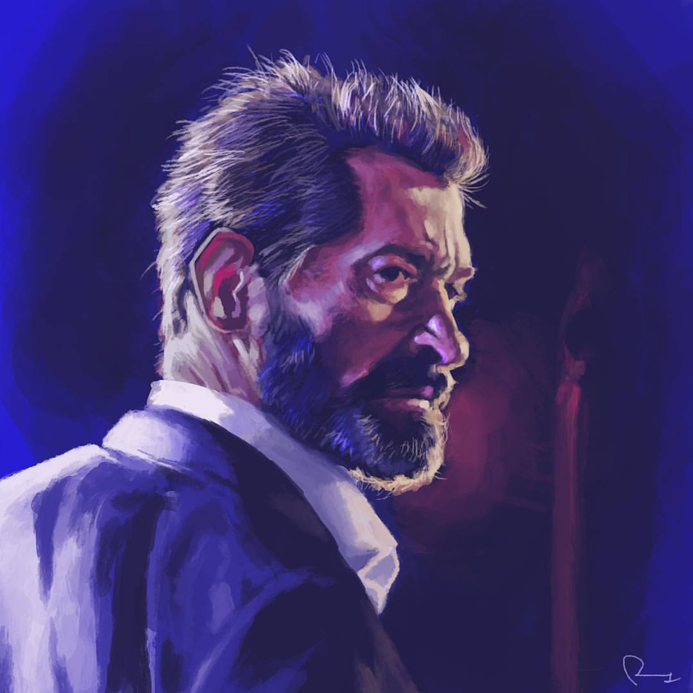

 

> "Joey, there's no living with it. The killing. There's no going back from
> it. Right or wrong is a brand. A brand sticks. There's no going back. Now, you run
> on home to your mother and tell her … tell her everything's alright. There aren't
> any more guns in the valley."

I can't think of a more fitting ending for Hugh Jackman's Wolverine, or indeed Patrick Stewart's Charles Xavier than Logan. A pitch-perfect movie in almost every regard, and gut-wrenching in every sense of the word. It's been 17 great years with Hugh playing the mutton-chopped, cigar-smoking, claw-wielding badass and now it's time to say goodbye.
