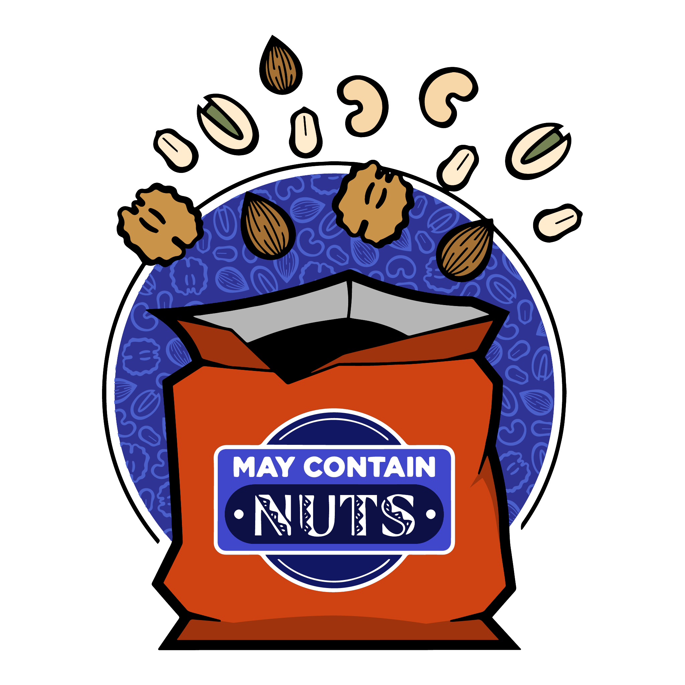

import { getImage, GatsbyImage } from "gatsby-plugin-image"
import { Carousel } from "../../../src/components/carousel"

 
May Contain Nuts is what happens when a couple of Yale-NUS alumni decide they want
to continue doing improv after graduation, and go around in a circle thinking of
punny names to call their newly minted improv troupe.

I started thinking about possible design directions we could take, the main goal being to inject humor into the mix (what even is the point of the group otherwise?). In that vein, I created a basic logo as a starting point, and explored a few variants that I found interesting. Exploring the idea of a police line-up of nuts (an allusion to the Usual Suspects), or going slightly darker with the humor - someone who had an anaphylactic shock due to being allergic to nuts (stylistically, I decided to go with a Cyanide & Happiness aesthetic to strengthen the visual reference). I also decided to incorporate one of the most classic pranks of all time into a logo for us - the old snake in a tin of nuts routine (Personally, this was my favorite due to the reference and the long association with comedy).

  <GatsbyImage
    className="w-full h-full"
    image={getImage(
      props.data.mdx.frontmatter.embeddedImagesLocal[0]?.childImageSharp
        ?.gatsbyImageData
    )}
    style={{ mixBlendMode: "multiply" }}
  />
  <GatsbyImage
    className="w-full h-full"
    image={getImage(
      props.data.mdx.frontmatter.embeddedImagesLocal[1]?.childImageSharp
        ?.gatsbyImageData
    )}
    style={{ mixBlendMode: "multiply" }}
  />
  <GatsbyImage
    className="w-full h-full"
    image={getImage(
      props.data.mdx.frontmatter.embeddedImagesLocal[2]?.childImageSharp
        ?.gatsbyImageData
    )}
    style={{ mixBlendMode: "multiply" }}
  />
  <GatsbyImage
    className="w-full h-full"
    image={getImage(
      props.data.mdx.frontmatter.embeddedImagesLocal[3]?.childImageSharp
        ?.gatsbyImageData
    )}
    style={{ mixBlendMode: "multiply" }}
  />

 
In the end, we decided to opt for the more traditional route. The colours are an
homage to our formation and shared status as Yale-NUS alumni, orange and blue
being our school colors, and the background texture of nuts is meant to
symbolise batik style printing as an homage to the batik elephant pants that are
sort of an unofficial uniform for Yale-NUS students.

At this point, if you're disappointed that we didn't go for some of the other designs, fret not! Some of the other ideas were put to good use for our upcoming shows.

Doing design work for May Contain Nuts allowed me to be creative in a way you don't get to do with clients or… anyone who takes themselves too seriously for that matter. It is a unique and singular privilege. Featured below are some of my favourite pieces I've put together for our shows.

<Carousel
  embeddedImagesLocal={[
    props.data.mdx.frontmatter.embeddedImagesLocal[4],
    props.data.mdx.frontmatter.embeddedImagesLocal[5],
    props.data.mdx.frontmatter.embeddedImagesLocal[6],
  ]}
/>
