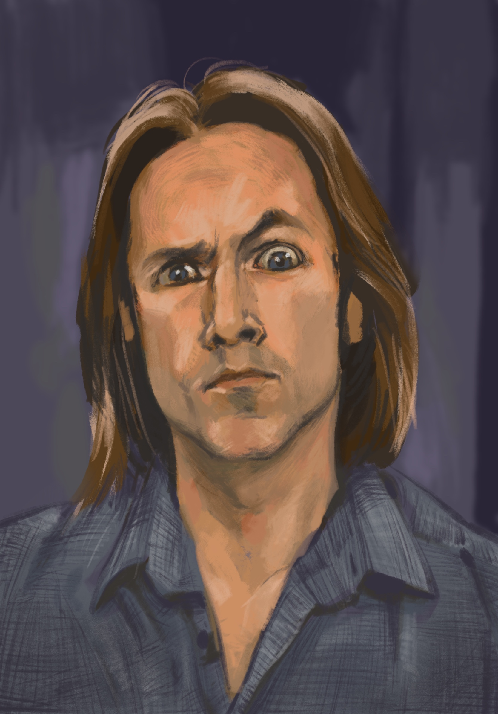

 

A bit rusty, given a break from drawing for a while. So here's a quick-ish sketch of Critical Role's DM - Matthew Mercer. Apart from work, improv and all the other distractions I have in my life, I blame this man and the ridiculously engaging world he's created for Critical Role. I fully believe it to be the most amount of content I have ever binged from a single creator.

And, yet I keep asking the question - Is it Thursday Yet? (if you know, you know)
