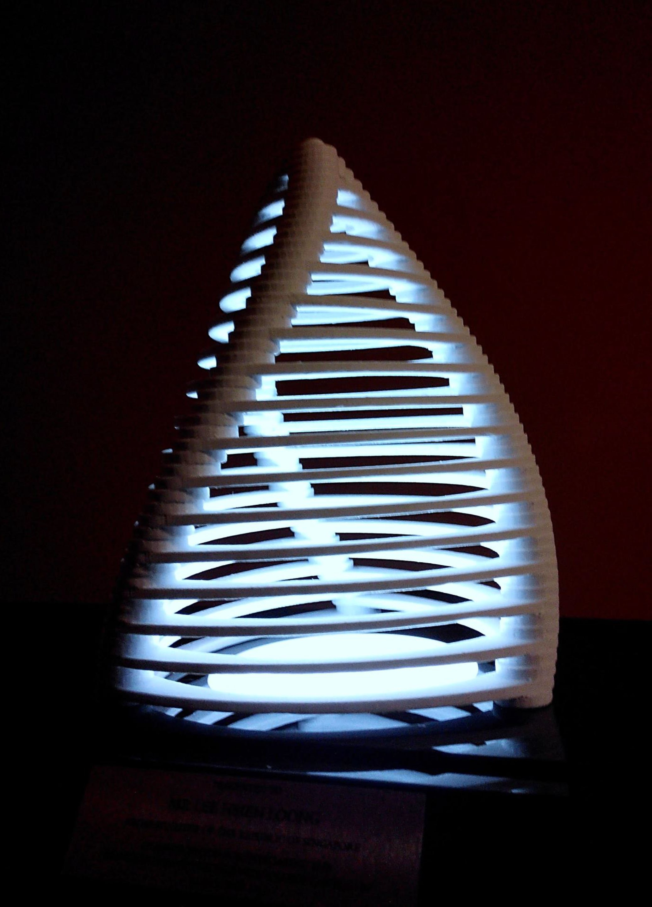

import { getImage, GatsbyImage } from "gatsby-plugin-image"

 

So I was told that the Prime Minister of Singapore, Lee Hsien Loong was going to
be the guest of honor at the Inauguration of Yale-NUS College, and that I had been
asked to design a memento that would be presented to him at the end of the ceremony.
No pressure.

This was a particularly tough nut to crack - the brief had been something mathematical given PM Lee's background but also something representing the college. So I thought of a couple of design elements to start myself off with. The first was the number 3. There needed to be 3 of whatever it was, given that there were 3 residential colleges. Obsessing slightly over the number I was reminded of an image I had seen during our last week at our Yale summer immersion program, in a talk about liberal arts and its place in our world. It was this depiction of the three tenets of the classical liberal arts - grammar, logic and rhetoric - called the Trivium. I was also thinking of what the three residential colleges meant to Yale-NUS, and the truth of it was that these 3 colleges together made up the identity of the college - its DNA, if you will. There it was. I had my visual language.

  <GatsbyImage
    className="w-full h-full"
    image={getImage(
      props.data.mdx.frontmatter.embeddedImagesLocal[0]?.childImageSharp
        ?.gatsbyImageData
    )}
  />
  <GatsbyImage
    className="w-full h-full"
    image={getImage(
      props.data.mdx.frontmatter.embeddedImagesLocal[1]?.childImageSharp
        ?.gatsbyImageData
    )}
  />

With a vision and some sketches of arcs and shapes in hand, I set about modelling this thing. I modelled it in SketchUp, because it was easy to prototype in and it was what I was most familiar with at the time, and I finished it up and rendered it in Autodesk Fusion 360. This really allowed me to get a good sense of what the final sculpture would look like.

And so it was that we went about printing this thing. While we did have a fabrication lab in Yale-NUS at the time, fully furnished with 3D printers of our own, the bureaucratic nightmare that is the college's health, safety and insurance protocols meant that we couldn't actually use them. And so it was that we sought the help of Simplifi3d, a local company that did a fantastic job with the printing of this thing.

  <GatsbyImage
    className="h-full"
    style={{ width: "39%" }}
    image={getImage(
      props.data.mdx.frontmatter.embeddedImagesLocal[2]?.childImageSharp
        ?.gatsbyImageData
    )}

/>

  <GatsbyImage
    className="h-full"
    style={{ width: "40%" }}
    image={getImage(
      props.data.mdx.frontmatter.embeddedImagesLocal[3]?.childImageSharp
        ?.gatsbyImageData
    )}
  />
  <GatsbyImage
    className="h-full"
    style={{ width: "22.5%" }}
    image={getImage(
      props.data.mdx.frontmatter.embeddedImagesLocal[4]?.childImageSharp
        ?.gatsbyImageData
    )}
  />

 

Somewhere along at this point, I decided to add a little light at the bottom to illuminate the entire thing, but I never actually got to see it being attached to the base or the finished product until the day itself. The main photo I have of it was actually taken backstage minutes before I was asked to present this. This was the final abstract written for the piece, slightly jazzed up by the college’s PR department.

> “The sculpture is a three-sided helical pyramid, converging upwards in a tapering mathematical exponential function. The three sides represent not only the Trivium - the three disciplines of logic, rhetoric and grammar, which make up a traditional liberal arts education, but also represent the three residential colleges of Yale- NUS at its base, while the helical structure takes inspiration from the double-helix structure of DNA, representing the identity of the three colleges. The convergence of the three sides signifies the progression towards combined knowledge in the Liberal Arts as a product of the convergence of the Trivium, as well as the unified identity of Yale-NUS College as an assimilation of the DNA of the three residential colleges. The mathematical nature of the sculpture is echoed in the Sol Le Witt mural in front of the performance hall.    
> Using the latest 3D printing technology (PLA Polylactic Acid Filament) made from plant products including corn, potatoes or sugar-beets, PLA is considered a more ‘earth friendly’ plastic compared to petroleum based ones.”

<GatsbyImage
  className="h-full w-full"
  image={getImage(
    props.data.mdx.frontmatter.embeddedImagesLocal[5]?.childImageSharp
      ?.gatsbyImageData
  )}
/>
 
